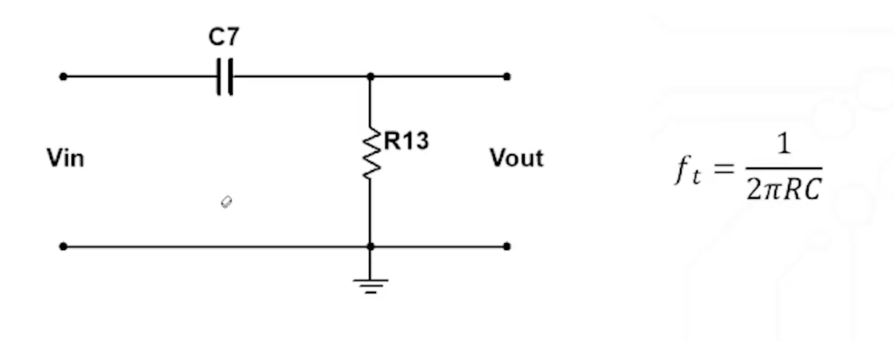
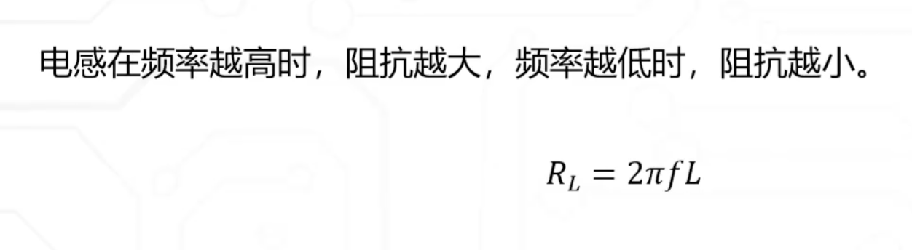
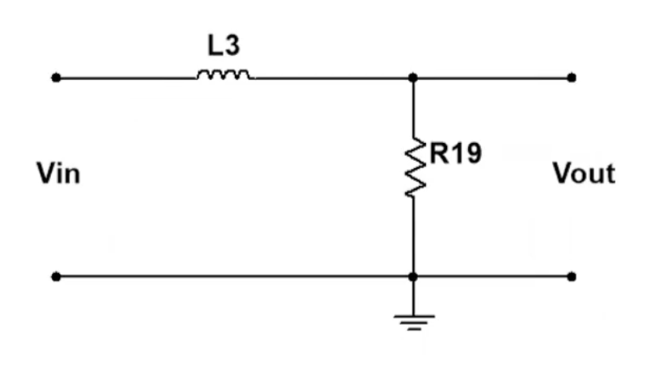

## 硬件笔记

### 电阻

#### 基本作用

##### 欧姆定律

##### 限流

* 电阻的功率 P= UI

##### 分流

并联分流
$$
I = I_1+ I_2+I_3
$$

##### 分压

串联分压
$$
V_R=\frac{\left(V_1-V_2\right) * R_2}{R_1+R_2}+V_2
$$

### 电容

电解电容区分正负极

|  **电容类型**  | **容量范围**  |    **电压范围**     | **ESR** | **温度稳定性** | **频率响应** | **极性** |    **寿命**    | **成本** | **典型应用场景**                       |
| :------------: | :-----------: | :-----------------: | :-----: | :------------: | :----------: | :------: | :------------: | :------: | :------------------------------------- |
|  **陶瓷电容**  |  1pF - 100μF  |      6V - 1kV       |  极低   |      中等      |  高（GHz）   |    无    | 长（无电解液） |    低    | 高频去耦、滤波、射频电路               |
| **铝电解电容** |   1μF - 1F    |      6V - 450V      |   高    |  较差（±20%）  |  低（kHz）   |    有    |  短（易干涸）  |    低    | 电源滤波、低频储能、能量缓冲           |
|   **钽电容**   | 1μF - 1000μF  |     2.5V - 50V      |  中低   |  较好（±10%）  |  中（MHz）   |    有    |      中等      |    高    | 精密电源滤波、医疗设备、便携式电子产品 |
|  **薄膜电容**  | 100pF - 100μF |      50V - 2kV      |  极低   |  极好（±5%）   | 极高（GHz）  |    无    |      极长      |    高    | 音频耦合、高频谐振、EMI抑制            |
|  **超级电容**  |  0.1F - 10kF  | 2.3V - 5.5V（单节） |  极低   |  一般（±20%）  |  极低（Hz）  |    有    | 长（循环寿命） |    高    | 能量备份、瞬时功率补偿、储能系统       |
|  **云母电容**  |  1pF - 10nF   |     100V - 10kV     |  极低   |  极好（±1%）   | 极高（GHz）  |    无    |      极长      |   极高   | 高频振荡器、高精度定时电路             |
|  **CBB电容**   | 100pF - 10μF  |     100V - 1kV      |   低    |   好（±5%）    |  高（MHz）   |    无    |       长       |    中    | 电机启动、脉冲电路、照明设备           |

#### 基本作用

##### 电容两端电压不能突变

**电容两端的相对电压不能突变, 但是两端的电压可以同时突变**

##### 储能

RC电路

充电时间 = 4 * t

$$ t = R * C $$

* 延迟上电
* 延时断电

滤波:原因电压跌落, 电源延迟

##### 容抗计算公式

$$
R_c=\frac{1}{2 \pi f c}
$$
频率越高容抗越低

#### 低通滤波电路(过滤高频噪声)

低通滤波截止频率

峰值衰减-3DB 自身的0.707倍

#### 低通滤波原理

电流达到峰值时, 电容未充满电. 无法完全拟合波形, 

#### 高通滤波电路

### 电感

#### 基本作用

流过电感的电流不能突变

电感只限制电流的变化速度, 不改变电流峰值

电感电路中, 电阻突变, 发生大电压: 续流二极管处理高压

#### 电感低通滤波作用

