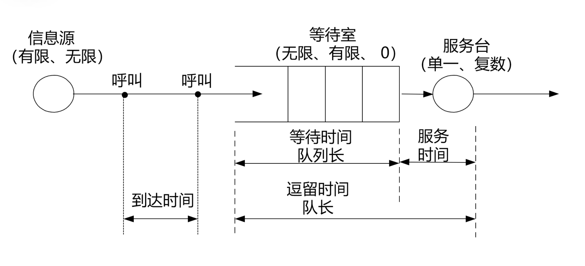

### 实时边缘计算理论与模型

#### 边缘计算与信息年龄

边缘计算基本模型

两个概念

**Latency** 

**data freshness**                    

信息年龄计算公式
$$
\Delta(t)=t-\max \left\{S_i: D_i \leq t\right\}
$$

#### 随机过程

* **随机变量**
* **随机过程**：一系列随时间变化的随机变量
* **样本轨道**
* **计数过程**
* **泊松过程**
  * 平稳增量
  * 独立增量

#### 排队论

##### 排队系统记号

$$
Q=\left.\frac{\mathrm{d}}{\mathrm{~d} t} P(t)\right|_{t=0}=\lim _{\Delta t \rightarrow 0} \frac{P(\Delta t)-I}{\Delta t}
$$

> **马尔可夫链**：
>
> 1. 状态空间
> 2. 无记忆性
> 3. 转移矩阵

排队论转移方程没学明白，

#### 平均信息年龄

定义如下
$$
\bar{\Delta}=\lim _{T \rightarrow \infty} \frac{1}{T} \int_0^T \Delta(t) \mathrm{d} t=\frac{\mathbb{E} Q}{\mathbb{E} X}
$$
两跳排队网络

#### 边缘计算中的信息年龄

边缘计算信息年龄模型(两跳排队网络)

本地计算平均信息年龄
$$
\Delta_l=\left.\bar{\Delta}\right|_{\mu_1=\mu_l, \mu_2 \rightarrow \infty}=\frac{2}{\mu_l}
$$
远程计算的平均信息年龄
$$
\Delta_s=\frac{1}{\mu_s}\left(\frac{\rho_s\left(2 \rho_s^2-\rho_s+1\right)}{\left(1+\rho_s\right)\left(1-\rho_s\right)}+\frac{2}{\rho_s}+1\right)
$$

* l: 本地计算速率
* t: 传输速率
* s: MEC计算速率
* $ \rho_{\mathrm{s}}=\mu_t / \mu_s $
* $ \rho_{\mathrm{c}}=\mu_l / \mu_s $

**减少排队, 保持包新鲜度**(丢包策略)

##### 使用丢包策略后, 结果对比

推荐阅读:

Real-time status: How often should we update

A survey on mobile edge computing: The communication perspective

### 边缘计算资源管理

#### 边缘计算模型特征

* 应用程序 服务功能可分割任务执行可迁移
* 数据可分布
* 资源可分布

### 物联网通用计算开发框架: 

#### EdgeX-Go

https://github.com/edgexfoundry/edgex-go

**南侧**

* 所有物联网器件，以及与这些设备，传感器或其他物联网器件直接通信的边缘网络

* 数据产生源

**北侧**

* 云计算中心或企业系统，以及与云中心通信的网络部分
* 存储，聚合和分析数据

**EdgeX Foundry**

* 连接两侧，提供边缘数据收集和分析等功能
* 微服务架构
  * 4个服务层和2个增强系统服务
  * Restful通信接口
* 设备服务层
  * 主要提供设备接入的功能，由多个设备服务组成。
  * 设备服务是用户根据SDK编写的微服务，支持多种协议
* 核心服务层
  * 由核心数据、命令、元数据注册表和配置等微服务组成·
  * 功能:存储和管理
    * 1)设备的元数据;
    * 2)从设备采集的数据;
    * 3)设备服务的配置信息
* 支持服务层
  * 提供边缘分析和智能服务、日志记录
  * 由规则引擎等微服务组成
* 应用/导出服务层
  * 导出服务:导出数据至自定义云或企业系统;
  * 应用服务(将取代导出服务):增加数据处理能力(转换、过滤、压缩和加密等);提供App Functions SDK以自定义函数。
* 系统服务
  * 安全:保护数据和指令的安全
  * 系统服务:用于监控微服务，如开启/停止/重启EdgeX的微服务,

#### Apache Edgent

**编程模型和运行时(runtime)**
可以嵌入网关或边缘设备对来自设备、车辆、传感器等数据流进行
本地实时分析

### 边缘云服务开源计算平台

* CORD
* Azure IoT Egde
* KubeEdge
* OpenEdge
* LinkEdge

### 边缘人工智能

重点应用, 视觉实时分析, 智慧城市/智慧交通, 工业互联网

#### 边缘智能推理关键技术

* KPI

  * 低延迟

  * 高精度

  * 低能耗

  * 隐私性

  * 计算和通信资源开销

深度学习->模型压缩

* 模型剪枝
* 参数量化: 降低精度
* 参数编码

方法: deep compression

Once for all network

* 设置多个退出点, 加速推理

* 批处理减少CPU和GPU通信开销, 减少计算和通信压力, 提高GPU利用率

* 模型分割, 任务卸载

* 使用缓存: 简单来说就是记忆化搜索, 保存结果, 对比输入
* 输入过滤
* 部署多个网络, 动态选择最优模型, 
* 数据压缩

硬件优化:

* 网络稀疏化
* 优化存储和通信
* 重构数据流
* 专用硬件计算器

#### 模型训练关键技术

* KPI

  * 低延迟

  * 损失

  * 收敛性

  * 隐私性

  * 计算和通信资源开销

* 联邦学习
  * 分布式学习
  * 减少通信成本
  * 参数聚合
* 梯度稀疏化
* 梯度量化
* 模型分割: 如何选择模型切割位置, 减少通信开销
* 迁移学习: 云端预训练一个基础网络, 然后边缘侧结合本地数据修正和个性化
* Gossip Learning

### 边缘人工智能案例

#### 推理优化

模型分割经典案例:

Neurosurgeon: Collaborative Intelligence Between the Cloud and Moobile Edge

SPINN: 通过压缩切片分层网络来降低传输延迟

CLIO: 对切分层网络进行切片, 渐进传输至云端, 以应对网络波动性

DeepX: 将模型依次切分为多个部分, 每个部分在最合适的设备上运行

MoDNN: 基于多个设备的计算能力, 对模型进行等比例纵向切分, 从而减少数据拉取

MusicalChairL: 基于多个设备的计算能力, 对模型和输入数据进行分割, 实现模型和数据并行

#### 训练优化

分布式学习VS集中学习

### 边缘视频分析

常用方法DNN

AlexNet ResNet Yolo 

视频检测流程

传统云计算DNN缺点

* 延迟
* 带宽
* 可用性
* 电力资源
* 安全性和隐私性

边缘计算定义:

边缘计算视频分析优点

* 减少带宽
* 低延迟
* 安全性

边缘资源管理-> 分配计算资源

#### 核心技术

DNN模型优化

* 内存加载和卸载
* 批处理运行
* 大模型云上协同

感知端虚拟化->应用多个需求(摄像头虚拟化)

输入过滤

* camera端
* Edge端
* 过滤相同的frame
  * 像素
  * 特征
* 只能选择需要计算(上传)的frame

Edge node 协同处理

多任务协同, 带宽和计算资源分配

#### 机遇和挑战

* 硬件结构Edge processing unit
* 分布式协同系统
* 资源管理和分配
* 命名机制
* 自动化系统
* 安全/隐私/DDos
* 5G / 自我管理能力
* 边缘备份/ 微服务

### 分布式机器学习

* 数据与模型划分
* 单机训练
* 协作与通讯
* 数据与模型聚合

#### 并行模式

* 数据并行
  * 
* 模型并行

	* 横向划分
	* 纵向划分
	* 随机划分
	* 混合划分

* 混合并行

#### 通信机制

* 同步
* 异步
* 半同步/延时同步

MapReduce(同步模式)

基于参数服务器通信

去中心化通信拓扑

如何减少通信开销: 几次迭代之后通信?

##### 降低通信评率: Batch训练

##### 降低通信时间: 通信隐藏

* 计算和传输流水线
* 模型的训练和网络通信构成流水线
* 减少整体的训练时间开销
* 模型更新的延迟稍有增加

##### 减少通信数据量: 梯度压缩/过滤/量化

* 梯度稀疏化: 设置阈值, 过滤掉不重要的梯度更新

  * 固定阈值稀疏化
  * TopK稀疏化
  * Deep Gradient Compression
  * GTopK稀疏化
  * 基于熵的梯度稀疏化

  

* 模型低秩化: 矩阵低秩分解, 不重要的参数不通信

  * 模型低秩化处理通过低秩分解压缩参数来减少通信量
  * 探索参数中的低秩结构:矩阵低秩分解，将原来比较大的参数矩阵分解成几个较小的矩阵的乘积
  * 精度损失, 压缩与解压开销

* 梯度量化: 对梯度值进行量化减少bit数

  * 对梯度值进行量化减少bit数
  * 降低精度, 显著降低通信量
  * 主要方法
    * 1bit量化
    * QSGD
    * TernGrad

常见的分布式机器学习算法与特点

#### 联邦学习

* 在 2016 年由谷歌最先提出，原本用于解决安卓手机终端用户在本地更新模型的问题。
  设计目标!

* 在保障数据交换时的信息安全、《据隐私、保证合法合规的前提下在多参与方或多计算结点之间开展高效率的机器学习。
* 联邦学习算法:神经网络、随机森林等
* 联邦学习有望成为下一代人工智能协同算法和协作网络的基础。

##### TensorFlow/federated

