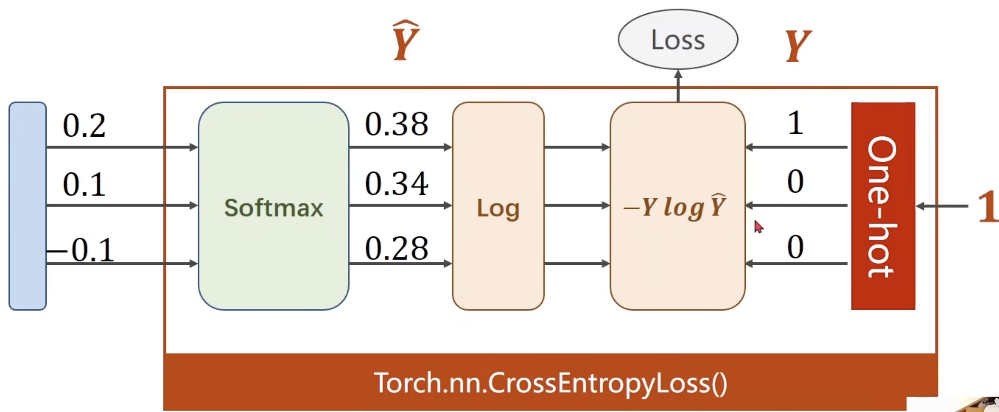

## Classification 

### Classification Dataset

#### The MNIST Dataset

* Training set: 60k
* Test set: 10k
* Classes: 10

https://docs.pytorch.org/vision/stable/datasets.html#built-in-datasets

### Mapping to [0, 1]

Logistic function
$$
\sigma (x) = \frac{1}{1 + e^{-x}}
$$

#### saturation function

limited to a fixed range between a minimum and maximum value.


#### sigmoid functions

* [-1, 1]
* Saturation
* Monotonic increasing


### Loss Function for Binary Classification

BCE Loss (Binary Cross Entropy): 
$$
loss = -(y \log{\hat{y} + (1 - y)} \log{(1 - \hat{y})})
$$


## Multiple Dimension input

神经网络越深维度越多 -> 学习能力强 -> 学习噪声 -> 泛化能力差

超参数搜索,


## DataLoader

#### Epoch 

One forward pass and one backward pass of all the training examples

#### Batch-size 

the number of training examples in one forward backward pass

#### Iterations

number of passes, each pass using [batch-size] number of examples


#### Abstract Class Dataset 

必须重写三个方法


```python
# torch.utils.data.Dataset
class CustomDataset(Dataset):
    def __init__(self, img_dir, transform=None):
        self.img_dir = img_dir
        self.transform = transform
        self.img_files = [f for f in os.listdir(img_dir) if f.endswith(('.jpg', '.png'))]

    def __len__(self):
        return len(self.img_files)

    def __getitem__(self, idx):
        img_path = os.path.join(self.img_dir, self.img_files[idx])
        image = Image.open(img_path).convert('RGB')
        label = 0  # 假设所有样本标签为0（需根据实际修改）
        
        if self.transform:
            image = self.transform(image)
        
        return image, label
```


### DataLoader

* Batch-size 
* shuffle 
* process number


### torchvision.datasets


## Softmax Clasifier

* nonnagative

* sum up to 1


NLL Loss

Torch.nn.CrossEntropyLoss()



最新版本需不需要激活函数?

CrossEntropyLoss 和 LogSoftmax + NLLLoss区别


|     **特性**     |           **CrossEntropyLoss**            |             **NLLLoss**              |
| :--------------: | :---------------------------------------: | :----------------------------------: |
|   **输入要求**   |       原始 logits（未经过 Softmax）       | 对数概率（需手动应用 `LogSoftmax`）  |
| **内部计算步骤** |  自动执行 `Softmax` + `Log` + 交叉熵计算  | 仅执行交叉熵计算（需前置 `Softmax`） |
|  **数值稳定性**  |        使用 LogSumExp 技巧避免溢出        |         需手动处理数值稳定性         |
| **典型应用场景** |     图像分类、文本分类（端到端任务）      |  语言模型、序列标注（需自定义概率）  |
|   **参数支持**   | 支持 `weight`（类别权重）、`ignore_index` |                 同左                 |

### Transforms

* ToTensor()

image to [0, 1]

Convert the PIL image to Tensor

image: W * H * C

tensor: C * W * H

* Normalize

$$
Pixel_{norm} = \frac{Pixel_{origin} - Mean}{std}
$$


### Test

```python
max_vals, max_indices = torch.max(x, dim=1)
# max_vals: tensor([5, 8])  # 每行的最大值
# max_indices: tensor([1, 0])  # 最大值所在列索引
```

Get one-hot index


## Basic CNN

fully linear neutral network: 损失空间结构

#### Convolution

#### single input Channel

卷积核做数乘


4-dim outpu

m * n * kernel_width * kernel_height


##### padding


##### stride


#### Subsampling


##### Max Polling

通道数不变

#### Feature Extraction

#### Classification

