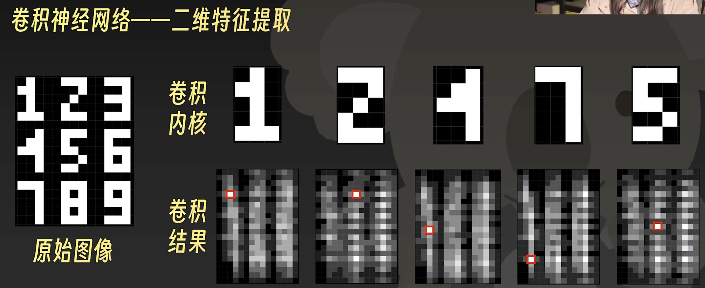
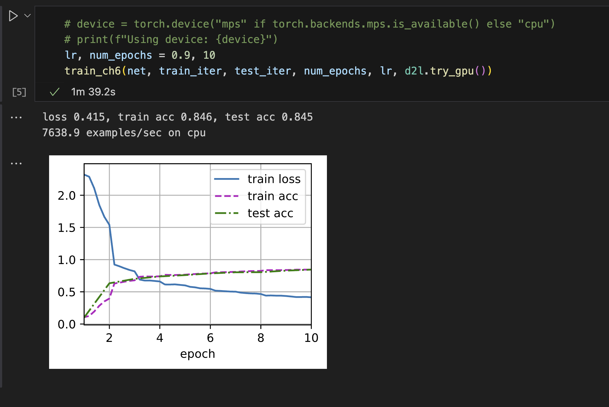
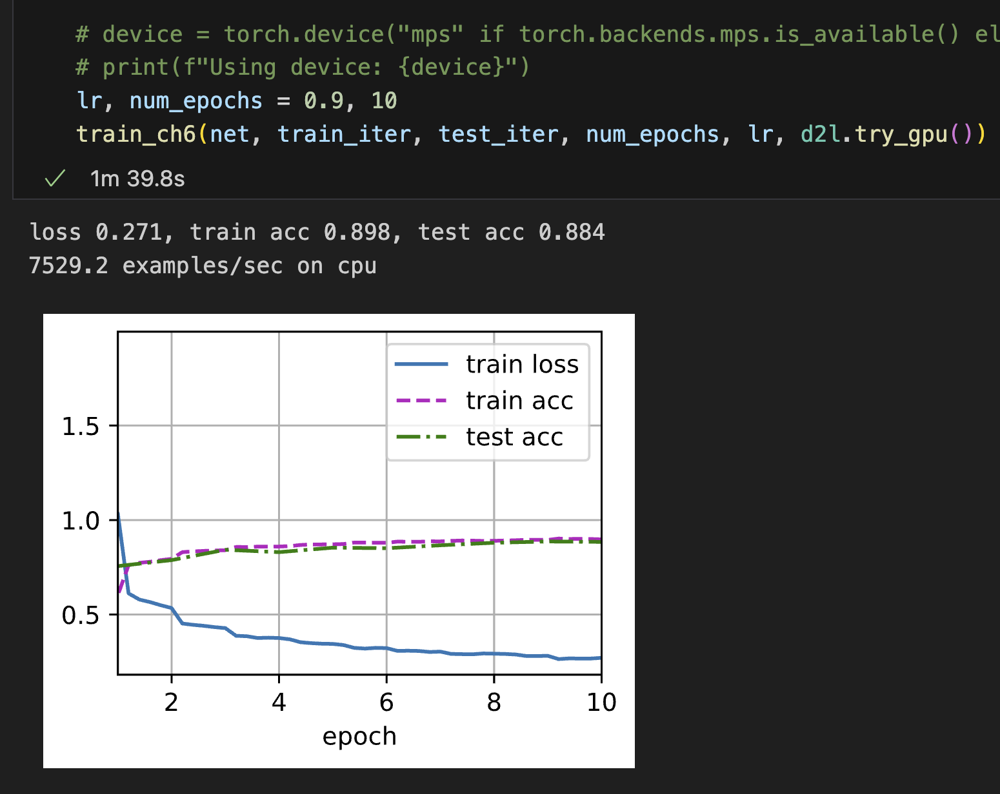

# 卷积神经网络

## MLP 到 CNN

#### 为什么要使用CNN？

如果使用MLP处理图片数据，像素作为输入直接计算爆炸，无法有效处理。

#### 为什么可以使用CNN？

1. *平移不变性*（translation invariance）：不管检测对象出现在图像中的哪个位置，神经网络的前面几层应该对相同的图像区域具有相似的反应，即为“平移不变性”。

1. *局部性*（locality）：神经网络的前面几层应该只探索输入图像中的局部区域，而不过度在意图像中相隔较远区域的关系，这就是“局部性”原则。最终，可以聚合这些局部特征，以在整个图像级别进行预测。

#### MLP为什么不行？

如果使用MLP，无论是输入还是隐藏表示都拥有空间结构。w将升阶成二维，输出h对应也为二维矩阵。

我们只关心局部特征， 相距太远的输入直接没有必要的相关性， 可以降低w矩阵的大小。仅接受局部的输入， 根据平移不变性，总会在某个位置找到感兴趣点。

### 卷积



#### 通道

图像不是二维张量，而是一个由高度、宽度和颜色组成的三维张量。

由于输入图像是三维的，我们的隐藏h表示也最好采用三维张量。

对于每一个空间位置，我们想要采用一组而不是一个隐藏表示。这样一组隐藏表示可以想象成一些互相堆叠的二维网格。 因此，我们可以把隐藏表示想象为一系列具有二维张量的***通道*（channel）**。 这些通道有时也被称为***特征映射*（feature maps）**，

**因为每个通道都向后续层提供一组空间化的学习特征。 直观上可以想象在靠近输入的底层，一些通道专门识别边缘，而一些通道专门识别纹理。**如上图所示， 与卷积核最相似的位置值越大

## 图像卷积

### 互相关运算（cross-correlation）

在卷积层中，输入张量和核张量通过互相关运算产生输出张量。


### 卷积层

卷积层对输入和卷积核权重进行互相关运算，并在添加标量偏置之后产生输出。

卷积层中的两个被训练的参数是卷积核权重和标量偏置。 就像我们之前随机初始化全连接层一样，在训练基于卷积层的模型时，我们也随机初始化卷积核权重。

### 学习卷积核

当有了更复杂数值的卷积核，或者连续的卷积层时，我们不可能手动设计滤波器。

输入图像放大之后学习率也要相应改变

```python
X = X.reshape((1, 1, 8, 8))
Y = Y.reshape((1, 1, 8, 7))
lr = 0.009  # 学习率

#X = X.reshape((1, 1, 6, 8))
#Y = Y.reshape((1, 1, 6, 7))
#lr = 3e-2  # 学习率

for i in range(20):
    Y_hat = conv2d(X)
    l = (Y_hat - Y) ** 2
    conv2d.zero_grad()
    l.sum().backward()
    # 迭代卷积核
    conv2d.weight.data[:] -= lr * conv2d.weight.grad
    if (i + 1) % 2 == 0:
        print(f'epoch {i+1}, loss {l.sum():.3f}')
```

### 互相关和卷积

由于卷积核是从数据中学习到的，因此无论这些层执行严格的卷积运算还是互相关运算，卷积层的输出都不会受到影响。

### *特征映射*（feature map）和 *感受野*（receptive field）

输出的卷积层有时被称为*特征映射*（feature map），因为它可以被视为一个输入映射到下一层的空间维度的转换器。 在卷积神经网络中，对于某一层的任意元素，其*感受野*（receptive field）是指在前向传播期间可能影响计算的所有元素（来自所有先前层）。

## 填充和步幅

填充和步幅都会直接影响输出矩阵的大小

### *填充*（padding）

**解决边缘像素丢失问题**

由于我们通常使用小卷积核，因此对于任何单个卷积，我们可能只会丢失几个像素。 但随着我们应用许多连续卷积层，累积丢失的像素数就多了。 解决这个问题的简单方法即为*填充*（padding）：在输入图像的边界填充元素（通常填充元素是）。

### *步幅*（stride）

在计算互相关时，卷积窗口从输入张量的左上角开始，向下、向右滑动。

有时候为了高效计算或是缩减采样次数，卷积窗口可以跳过中间位置，每次滑动多个元素。


### 输出形状

垂直步幅为$s_h$、水平步幅为时$s_w$，输出形状为
$$
\lfloor(n_h-k_h+p_h+s_h)/s_h\rfloor \times \lfloor(n_w-k_w+p_w+s_w)/s_w\rfloor.
$$


## 多输入多输出通道

### 多输入通道

当输入包含多个通道时，需要构造一个与输入数据具有相同输入通道数的卷积核，以便与输入数据进行互相关运算。


### 多输出通道

为了获得多个通道的输出，我们可以为每个输出通道创建一个卷积核张量

卷积核的形状为$ c_o\times c_i\times k_h\times k_w $

在互相关运算中，每个输出通道先获取所有输入通道，再以对应该输出通道的卷积核计算出结果。


#### 1*1 卷积层

因为使用了最小窗口，卷积失去了卷积层的特有能力——在高度和宽度维度上，识别相邻元素间相互作用的能力。

我们可以将1*1卷积层看作在每个像素位置应用的全连接层


## 汇聚层

我们希望逐渐降低隐藏表示的空间分辨率、聚集信息，这样随着我们在神经网络中层叠的上升，每个神经元对其敏感的感受野（输入）就越大。

**降低卷积层对位置的敏感性，同时降低对空间降采样表示的敏感性。**

### 最大汇聚层和平均汇聚层

与卷积层类似，汇聚层运算符由一个固定形状的窗口组成，该窗口根据其步幅大小在输入的所有区域上滑动，为固定形状窗口（有时称为*汇聚窗口*）遍历的每个位置计算一个输出。 然而，不同于卷积层中的输入与卷积核之间的互相关计算，汇聚层不包含参数。 相反，池运算是确定性的，我们通常计算汇聚窗口中所有元素的最大值或平均值。这些操作分别称为*最大汇聚层*（maximum pooling）和*平均汇聚层*（average pooling）。

与互相关运算符一样，汇聚窗口从输入张量的左上角开始，从左往右、从上往下的在输入张量内滑动。在汇聚窗口到达的每个位置，它计算该窗口中输入子张量的最大值或平均值。计算最大值或平均值是取决于使用了最大汇聚层还是平均汇聚层。


汇聚窗口形状为$p \times q$的汇聚层称为$p \times q$汇聚层，汇聚操作称为$p \times q$汇聚


### 填充和步幅

与卷积层一样，汇聚层也可以改变输出形状。


### 多通道

在处理多通道输入数据时，汇聚层在每个输入通道上单独运算，而不是像卷积层一样在通道上对输入进行汇总。 这意味着汇聚层的输出通道数与输入通道数相同。


## LeNet


主要有两部分组成：

- 卷积编码器：由两个卷积层组成;
- 全连接层密集块：由三个全连接层组成。



将sigmoid换成ReLu激活函数后， 明显观察到loss降低同时accuracy增加



## AlexNet

### 
