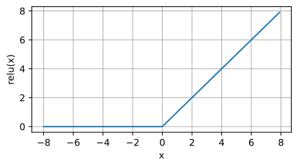
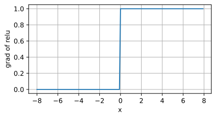
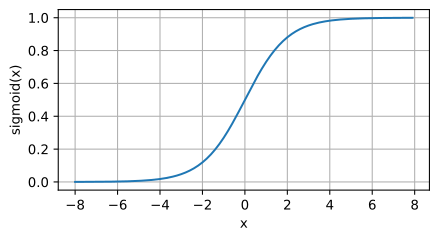
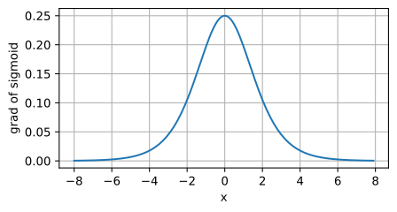
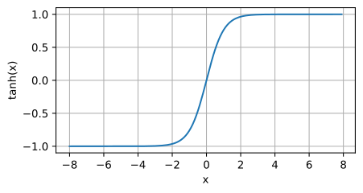
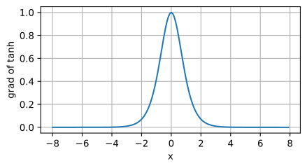

## 激活函数

### ReLU函数

$$
\operatorname{ReLU}(x) = \max(x, 0).
$$

ReLU函数通过将相应的活性值设为0，仅保留正元素并丢弃所有负元素。

当输入为负时，ReLU函数的导数为0，而当输入为正时，ReLU函数的导数为1。 注意，**当输入值精确等于0时，ReLU函数不可导。 在此时，我们默认使用左侧的导数，即当输入为0时导数为0。** 我们可以忽略这种情况，因为输入可能永远都不会是0。

导数图像:

使用ReLU的原因是，**它求导表现得特别好：要么让参数消失，要么让参数通过。**

### sigmoid函数

[sigmoid functions]https://en.wikipedia.org/wiki/Sigmoid_function) 

- [-1, 1] --> bounder
- Saturation  --> 当输入超过某个阈值后，输出不再显著变化（趋于恒定值）。
- Monotonic increasing

#### Definition

A sigmoid function is a [bounded](https://en.wikipedia.org/wiki/Bounded_function), [differentiable](https://en.wikipedia.org/wiki/Differentiable_function), real function that is defined for all real input values and has a positive derivative at each point.

#### Logistic function

$$
f(x) = \frac{1}{1 + e^{-x}}
$$

它将范围（-inf, inf）中的任意输入压缩到区间（0, 1）中的某个值：

导数图像如下所示。 注意，当输入为0时，sigmoid函数的导数达到最大值0.25； 而输入在任一方向上越远离0点时，导数越接近0。

tanh函数
$$
\operatorname{tanh}(x) = \frac{1 - \exp(-2x)}{1 + \exp(-2x)}.
$$
当输入在0附近时，tanh函数接近线性变换。 函数的形状类似于sigmoid函数， 不同的是tanh函数关于坐标系原点中心对称。

tanh函数的导数图像如下所示。 当输入接近0时，tanh函数的导数接近最大值1。 与我们在sigmoid函数图像中看到的类似， 输入在任一方向上越远离0点，导数越接近0。

将模型在训练数据上拟合的比在潜在分布中更接近的现象称为*过拟合*（overfitting）， 用于对抗过拟合的技术称为*正则化*（regularization）

### 权重衰退

1. **抑制噪声特征的影响**
   - 若某些特征包含噪声（如随机波动或无关信息），模型可能通过增大对应权重来强行拟合这些噪声。
   - 权重衰减通过惩罚大权重，使模型倾向于赋予噪声特征较小的权重，降低其影响力
2. **提升模型泛化能力**
   - 过大的权重会导致模型对训练数据的微小变化敏感（如噪声扰动），降低在测试数据上的表现。
   - 小权重使模型输出更平滑，增强对未知数据的适应性
3. **平衡模型复杂度**
   - 权重衰减通过限制参数空间，防止模型学习过于复杂的模式（如噪声中的伪相关），从而保持模型简洁性

# 环境和分布偏移

## 分布偏移的类型

### 协变量偏移

### 标签偏移

### 概念便宜