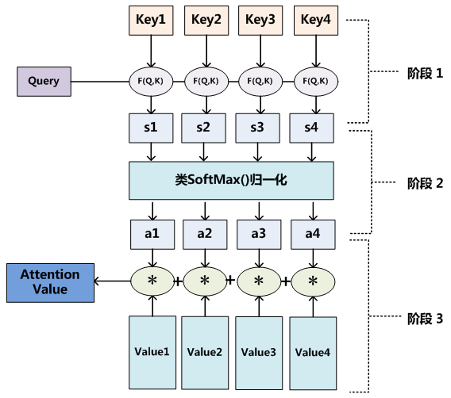
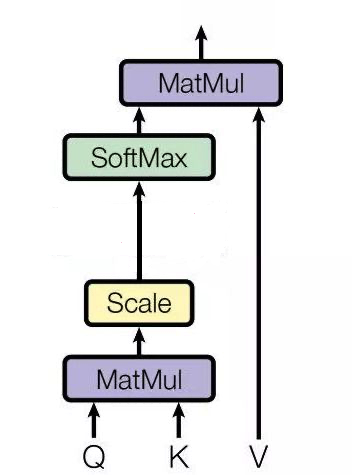
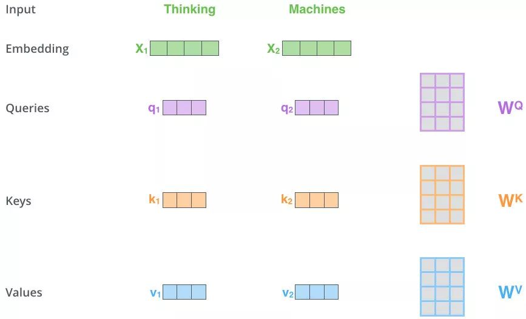
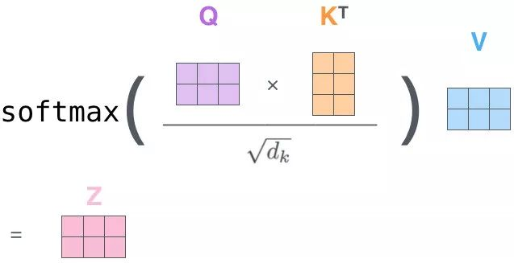

## Attention

注意力模型 Attention 的本质思想为：从大量信息中有选择地筛选出少量重要信息并聚焦到这些重要信息上，忽略不重要的信息。

通过 Query 这个信息从 Values 中筛选出重要信息，简单点说，**就是计算 Query 和 Values 中每个信息的相关程度。**

每个 key、每个 value 都是向量，输出是 V 中所有 values 的加权，其中权重是由 Query 和每个 key 计算出来的

1. 点乘（**Transformer 使用**）：$ f(Q,K_i)=Q^\top K_i $
2. 权重：  $ f(Q,K_i)=Q^\top WK_i $
3. 拼接权重：$ f(Q,K_i)=W[Q^\top;K_i] $
4. 感知器： $ f(Q,K_i) = V tanh(WQ+UK_i) $

针对计算出来的权重 αi，对 V 中的所有 values 进行加权求和计算，得到 Attention 向量：$ Attention= \sum_{i = 1}^{m}α_i V_i$

## self-attention

**对于 Self Attention，Q、K、V 来自句子 X 的 词向量 x 的线性转化，即对于词向量 x，给定三个可学习的矩阵参数 WQ,Wk,Wv，x 分别右乘上述矩阵得到 Q、K、V**。

