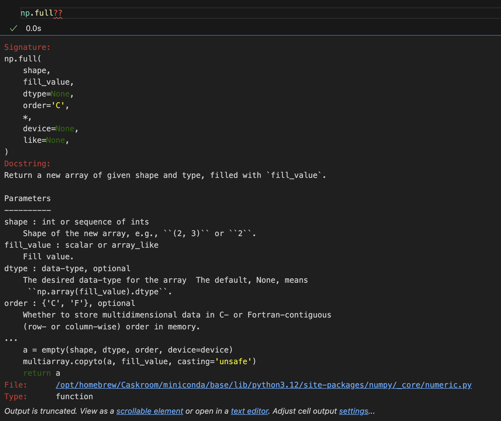

# Numpy

## 创建array

```python
# 基本创建方法
numpy.array(object, dtype = None, copy = True, order = None, subok = False, ndmin = 0)

numpy.arange(start, stop, step, dtype)  //从 0 到 n - 1
```


### array创建数组

numpy.array(object, dtype = None, copy = True, order = None, subok = False, ndmin = 0)

```python
a = np.array([1,2,3,4,5,6,7,8,9])
b = np.array([[1,2,3,4],[5,6,7,8]])
c = np.array([[1,2,3],[4,5,6],[7,8,9]])
```

### arrange创建数组

numpy.arange(start, stop, step, dtype)

```python
a = np.arange(10)
b = np.arange(0, 10, 2)
c = np.arange(0, 1, 0.1, dtype=float)
```


### 随机数数组
#### 随机数
numpy.random.random(size)

#### 随机种子(固定随机数)
np.random.seed(0)

#### 随机整数(随机整数)
np.random.randint(low, high, size)

#### 正态分布 (期望0 方差1)
np.random.randn(1)
np.random.normal(loc = 3, scale = 4, size = (2,3)) loc期望 scale方差

```python
np.random.seed(0)
np.random.random((2,5,4))
np.random.randint(0, 100, size = 1)
np.random.randn(10)
np.random.normal(5,5,(2,3))
```


## ndarray对象

| 属性      | 说明                     |
| :-------- | ------------------------ |
| .ndim     | 维度                     |
| .shape    | 形状                     |
| .size     | 元素的个数               |
| .dtype    | 元素类型                 |
| .itemsize | 每个元素大小, 字节为单位 |


## 其他方式创建array

### zeros创建数组

np.zeros(shape, dtype = None, order = 'C')

np.zeros_like()  // 根据传入的数组形状创建0数组

```python
np.zeros(shape=(10,10), dtype=int)
a = np.random.randn(3,3)
np.zeros_like(a)
```

### ones创建数组

np.ones(shape, dtype = None, order = 'C')

np.ones_like()  // 根据传入的数组形状创建1数组

```python
np.ones(shape=(10,10), dtype=int)
a = np.random.randn(3,3)
np.ones_like(a)
```

### empty创建
创建一个指定形状, 数据类型且未初始化的数组,元素的值是之前内存的值

np.empty(shape, dtype = float, order = 'C')

np.empty_like()  //根据传入的数组形状创建空数组

```python
x = np.empty(10, dtype=int)
a = np.arange(5)
np.add(a, 2, out = x[2:a.size+2])
x
```

### full创建
穿件全为某个值的数组

np.full(shape, fill_value)

np.empty_like(ndarray, fill_value)  //根据传入的数组形状创建

```python
np.full((5,5), 9)
```

### 创建单位矩阵

np.eye(size, dtype)

np.identity(size, dtype)

```python
np.eye(5, dtype=int)
```

### Linspace创建等差数列

np.linspace(start, stop, num=50, endpoint=True, retstep=False, dtype=None)


| 参数     | 描述                                                         |
| -------- | ------------------------------------------------------------ |
| start    | 序列起始值                                                   |
| stop     | 序列的终止值                                                 |
| num      | 样本数量                                                     |
| endpoint | 该值为 ture 时，数列中中包含stop值，反之不包含，默认是True。 |
| retstep  | 如果为 True 时，生成的数组中会显示间距，反之不显示。         |
| dtype    | ndarray 的数据类型                                           |

```python
np.linspace(1,5,5,endpoint=True,retstep=True)
np.linspace(1,5,5,endpoint=False,retstep=True)
```


### logspace创建等比数列

np.logspace(start, stop, num=50, endpoint=True, base=10.0, dtype=None)

| 参数     | 描述                                                         |
| -------- | ------------------------------------------------------------ |
| start    | 序列的起始值为：base ** start                                |
| stop     | 序列的终止值为：base ** stop。如果endpoint为true，该值包含于数列中 |
| num      | 要生成的等步长的样本数量，默认为50                           |
| endpoint | 该值为 ture 时，数列中中包含stop值，反之不包含，默认是True。 |
| base     | 对数 log 的底数。                                            |
| dtype    | ndarray 的数据类型                                           |

```
np.logspace(0,10,num = 10, base = 2,dtype=int)
```


## 索引和切片

ndarray 数组可以基于 0 - n 的下标进行索引，并设置 start, stop及 step 参数进行，从原数组中切割出一个新数组。

```python
x[-3:-1]
x[0:10:2]
x[-2]
```


### 二维数组的索引和切片

```python
x[0][2:3]
x[1:4,1]
x[1:4][1] #注意区分
x[1:4:2, -1]
```

 

### 改变形状

```
#使用ravel函数将三维的b变成一维的数组

a1=b.ravel()

#使用flatten函数将二维的c变成一维的数组

a2=c.flatten()

#使用shape属性将三维的b变成二维数组(6行4列)

b.shape=(6,4)

#使用resize修改数组的维度

b.resize((2,12))
```


### 数组的拼接

concatenate()

| 函数        | 描述                           |
| ----------- | ------------------------------ |
| concatenate | 连接沿现有轴的数组序列         |
| hstack      | 水平堆叠序列中的数组（列方向） |
| vstack      | 竖直堆叠序列中的数组（行方向） |

```python
a = np.array([1,2,3])
b = np.array([4,5,6])
np.concatenate((a,b),axis=0)

a=np.array([[1,2,3],[4,5,6]])
b=np.array([['a','b','c'],['d','e','f']])
print(np.concatenate([a,b]))
print('x轴方向及垂直堆叠')
print(np.concatenate([a,b],axis=0))
print('y轴方向及水平堆叠')
print(np.concatenate([a,b],axis=1))

print(np.vstack([a,b]))
print(np.hstack([a,b]))

#三维替换
aa=np.arange(1,37).reshape(3,4,3)
bb=np.arange(101,137).reshape(3,4,3)
print('axis=0'*10)
print(np.concatenate((aa,bb),axis=0)) #6 4 3 

print('axis=1'*10)
print(np.concatenate((aa,bb),axis=1))
#3,8,3
print('axis=2'*10)
print(np.concatenate((aa,bb),axis=2))
```

axis=0可以使用vstack替换

axis=1可以使用hstack替换

axis=2可以使用dstack替换


### 数组的转置

transpose进行转换

```python
a=np.arange(1,13).reshape(2,6)
print('原数组a')
print(a)
print('转置后的数组')
print(a.transpose())
print(a.T)
```


### 数组的分隔

numpy.split 函数沿特定的轴将数组分割为子数组，格式如下：

```python
numpy.split(ary, indices_or_sections, axis)
```


#### 水平分割

#### 垂直分割


## 数学函数

|                          **方法**                           |                           **说明**                           |
| :---------------------------------------------------------: | :----------------------------------------------------------: |
|                   np.abs()、np.fabs()                   | 计算数组元素的绝对值（支持整数和浮点数）。`np.abs()` 是通用函数，`np.fabs()` 是数学函数。 |
|                         np.sqrt()                         |      计算数组元素的平方根。返回与原数组形状相同的数组。      |
|                      np.reciprocal()                      |     计算数组元素的倒数（1/x）。若元素为0，结果为无穷大。     |
|                        np.square()                        |            计算数组元素的平方（等价于 `x**2`）。             |
|                         np.exp()                          |               计算数组元素的指数值（*e**x*）。               |
|            np.log()、np.log10()、np.log2()            | 计算自然对数（ln(x)）、以10为底的对数（log10(x)）、以2为底的对数（log2(x)）。 |
|                         np.sign()                         |     返回数组元素的符号：1（正数）、0（零）、-1（负数）。     |
|           np.ceil()、np.floor()、np.rint()            |         向上取整、向下取整、四舍五入到最接近的整数。         |
|                         np.modf()                         |    将数组元素拆分为小数部分和整数部分，返回两个独立数组。    |
|             np.cos()、np.sin()、np.tan()             |     计算数组元素的余弦、正弦、正切值（默认输入为弧度）。     |
| np.add()、np.subtract()、np.multiply()、np.divide() | 二元运算：逐元素执行加法、减法、乘法、除法。需输入两个形状相同的数组。 |

```python
#np.modf()
arr = [0, 3.5, -0.5]
fraction, integral = np.modf(arr)
print("小数部分:", fraction)  # [ 0.   0.5 -0.5]
print("整数部分:", integral)  # [ 0.  3. -0.]


#numpy.around(a, decimals=0, out=None)
arr = [0.5538, 1.33354, 0.71445]
rounded = np.around(arr, decimals=3)
print(rounded)  # 输出：[0.554 1.334 0.714]  # 保留3位小数

#numpy.rint(x, out=None, **kwargs)
#将输入数组的每个元素 ​四舍五入到最接近的整数，返回与原数组形状相同的新数组。

#np.ceil()、np.floor()   向上取整、向下取整
```


## 算数函数

```python
#numpy.mod() 计算输入数组中相应元素的相除后的余数。函数
#numpy.remainder() 也产生相同的结果。

a=np.array([10,10,30])
b=np.array([3,5,7])
print(np.mod(a,b))
print(np.remainder(a,b))
print(a%b)

# [1 0 2]
# [1 0 2]
# [1 0 2]
```


## 统计函数

|    **函数名**    |                  **说明**                  |                         **参数说明**                         |                      **应用示例**                      |
| :--------------: | :----------------------------------------: | :----------------------------------------------------------: | :----------------------------------------------------: |
|   `np.sum(a)`    |            计算数组所有元素的和            |                 `axis=None`（默认整体求和）                  |              `np.sum([[1,2],[3,4]]) → 10`              |
|   `np.prod(a)`   |           计算数组所有元素的乘积           |                         `axis=None`                          |                 `np.prod([1,2,3]) → 6`                 |
|   `np.mean(a)`   |            计算数组元素的平均值            |                         `axis=None`                          |             `np.mean([[1,2],[3,4]]) → 2.5`             |
|   `np.std(a)`    |   计算数组元素的标准差（默认总体标准差）   |          `axis=None`, `ddof=0`（样本标准差时设为1）          |              `np.std([1,2,3,4]) → 1.118`               |
|   `np.var(a)`    |     计算数组元素的方差（默认总体方差）     |                    `axis=None`, `ddof=0`                     |               `np.var([1,2,3,4]) → 1.25`               |
|  `np.median(a)`  |            计算数组元素的中位数            |                         `axis=None`                          |              `np.median([1,3,5,7]) → 4.0`              |
| `np.power(a, p)` |   对数组元素进行幂运算（等价于 `a**p`）    |               `dtype=None`（可选指定输出类型）               |             `np.power([2,3], 3) → [8,27]`              |
|   `np.sqrt(a)`   |            计算数组元素的平方根            |                       仅支持非负数输入                       |               `np.sqrt([4,9]) → [2.,3.]`               |
|   `np.min(a)`    |               计算数组最小值               |                         `axis=None`                          |              `np.min([[5,2],[3,8]]) → 2`               |
|   `np.max(a)`    |               计算数组最大值               |                         `axis=None`                          |              `np.max([[5,2],[3,8]]) → 8`               |
|  `np.argmin(a)`  |       返回最小值在扁平化数组中的索引       |                         `axis=None`                          |             `np.argmin([[5,2],[3,8]]) → 1`             |
|  `np.argmax(a)`  |       返回最大值在扁平化数组中的索引       |                         `axis=None`                          |             `np.argmax([[5,2],[3,8]]) → 3`             |
|  `np.cumsum(a)`  |              沿指定轴累积求和              |                  `axis=None`, `dtype=None`                   |             `np.cumsum([1,2,3]) → [1,3,6]`             |
| `np.cumprod(a)`  |              沿指定轴累积求积              |                         `axis=None`                          |            `np.cumprod([1,2,3]) → [1,2,6]`             |
|   `np.ptp(a)`    | 计算数组最大值与最小值的差（peak-to-peak） |                         `axis=None`                          |                `np.ptp([1,3,5,7]) → 6`                 |
|  `np.unique(a)`  |          返回数组去重后的排序结果          | `return_index=False`, `return_inverse=False`, `return_counts=False` |            `np.unique([2,3,2,8]) → [2,3,8]`            |
| `np.nonzero(a)`  |    返回数组非零元素的索引（按维度分组）    |                              无                              | `np.nonzero([[0,1],[2,0]]) → (array[1,0], array[0,1])` |

```python
x = np.arange(1,5)
y = np.empty_like(x)
np.power(x, 2, out=y)
print(y)
```


## 其他函数

|            **方法**             |                           **说明**                           |                         **关键参数**                         |                       **应用场景示例**                       |
| :-----------------------------: | :----------------------------------------------------------: | :----------------------------------------------------------: | :----------------------------------------------------------: |
|       `np.tile(a, reps)`        |             沿行、列方向重复数组 `a`，生成新数组             |   `reps`：重复次数（如 `(2,3)` 表示行重复2次，列重复3次）    |  `np.tile([[1,2]], (2,3)) → [[1 2 1 2 1 2], [1 2 1 2 1 2]]`  |
| `np.repeat(a, repeats, axis=0)` |                       沿指定轴重复元素                       | `repeats`：每个元素重复次数；`axis`：操作轴（默认扁平化后操作） |    `np.repeat([1,2], repeats=3, axis=0) → [1,1,1,2,2,2]`     |
| `np.roll(a, shift, axis=None)`  |                       沿轴循环移位元素                       |               `shift`：位移量；`axis`：操作轴                |         `np.roll([1,2,3,4], 1, axis=0) → [4,1,2,3]`          |
|    `np.resize(a, new_shape)`    |              调整数组大小（可能填充或截断数据）              |                    `new_shape`：目标形状                     |  `np.resize([[1,2], [3,4]], (3,2)) → [[1 2], [3 4], [1 2]]`  |
|   `np.place(arr, mask, vals)`   | 根据布尔掩码 `mask`，将 `arr` 中对应位置替换为 `vals` 中的值 |             `mask`：布尔数组；`vals`：替换值数组             |   `np.place(a, a>2, [99,100]) → 将大于2的元素替换为99,100`   |
|      `np.put(arr, ind, v)`      |         按索引 `ind` 将 `arr` 中对应位置替换为值 `v`         |                 `ind`：索引数组；`v`：替换值                 |       `np.put(a, [0,2], [99,100]) → a[0]=99, a[2]=100`       |
|     `np.savetxt(fname, X)`      |             将数组保存为文本文件（默认空格分隔）             |           `delimiter`：分隔符；`fmt`：格式化字符串           |     `np.savetxt('data.txt', a, fmt='%d', delimiter=',')`     |
|       `np.loadtxt(fname)`       |             从文本文件加载数据（默认按空格分割）             |            `delimiter`：分隔符；`dtype`：数据类型            |         `a = np.loadtxt('data.txt', delimiter=',')`          |
|     `np.genfromtxt(fname)`      |        从文本文件加载数据，支持缺失值处理（如 `NaN`）        |    `missing_values`：缺失值标识；`filling_values`：填充值    | `a = np.genfromtxt('data.csv', delimiter=',', missing_values='NA')` |
|       `np.any(a, axis=0)`       |  检查数组是否存在至少一个 `True` 值（或可转为 `True` 的值）  |                        `axis`：操作轴                        | `np.any([[False, True], [True, False]], axis=0) → [True, True]` |
|       `np.all(a, axis=0)`       |               检查数组所有元素是否均为 `True`                |                        `axis`：操作轴                        | `np.all([[True, False], [True, True]], axis=1) → [False, True]` |
|   `np.where(condition, x, y)`   |      根据条件选择值：条件为 `True` 时取 `x`，否则取 `y`      |             `condition`：布尔数组；`x,y`：替换值             |     `np.where(a>5, 'High', 'Low') → 根据a的值返回字符串`     |
|         `np.dot(a, b)`          |                 矩阵乘法（若为向量则为点积）                 |                              无                              | `np.dot([[1,2], [3,4]], [[5,6], [7,8]]]) → [[19,22], [43,50]]` |
|      `np.sort(a, axis=-1)`      |                  沿指定轴返回排序后的新数组                  |                 `axis`：操作轴（默认最后轴）                 |      `np.sort([[3,1], [4,2]], axis=1) → [[1,3], [2,4]]`      |
|    `np.argsort(a, axis=-1)`     |                   返回沿指定轴排序后的索引                   |                        `axis`：操作轴                        |    `np.argsort([[3,1], [4,2]], axis=1) → [[1,0], [1,0]]`     |

```python
a = np.arange(4)

#tile和repeat区别
np.tile(a,2)
np.tile(a,(4,1))
np.repeat(a,2)

a = np.arange(1,13).reshape(3,4)
np.repeat(a,2)
np.repeat(a,2,axis=0)
np.repeat(a,2,axis=1)

#向前向后调整
np.roll(a,1,)
np.roll(a,-1,axis=0)
np.roll(a,-1,axis=1)


#place和put
aa = np.random.randint(40,100,(3,4))
#小于60分的 全部替换为0
np.place(aa,aa<60,0)

#put()指定的索引处的元素替换为指定的值
aa = np.arange(1,13).reshape(3,4)
np.put(aa,11,100)
aa

#savetxt loadtxt
a = np.random.randint(-40,100,(5,5))
np.savetxt('save.txt',a,fmt='%d')

b = np.loadtxt('save.txt',dtype=int)
b
```


## 数组排序

排序中主要用到的方法是np.sort和np.argsort。其中np.sort()是对

数组直接排序。而np.argsort()是返回排序后的原始索引。


```python
a=np.array([5,2,4,6,1,9])
print('sort排序后：',np.sort(a))
print('argsort排序：',np.argsort(a))
#sort排序后： [1 2 4 5 6 9]
#argsort排序： [4 1 2 0 3 5]

#多维排序
np.random.seed(44)
a = np.random.randint(0,100,(4,6))
print(a)
print(np.sort(a,axis=0))
print(np.sort(a,axis=1))

#使用索引
np.random.seed(44)
a = np.random.randint(0,100,(4,6))
b = a[:, -1]
print(a,b)

index = np.argsort(b)
print(a[index])
```


## 广播机制

```python
a=np.arange(3) #一行[0 1 2]
b=np.arange(3).reshape(3,1)
print(a+b)
#[[0 1 2]
# [1 2 3]
# [2 3 4]]
```


## 比较掩码

```python
a=np.array([[1,2,30],[45,67,89]])
print(a<60)

#[[ True  True  True]
# [ True False False]]

print(a[np.array([[ True , True , True],
[ True, False, False]])])
print(a[a<60])

#[ 1  2 30 45]
#[ 1  2 30 45]
```


-----

# 其他

### `order`参数的作用

1. **内存布局控制**
   - **`order='C'`（默认）**：按**行优先（Row-major）**顺序存储。即数组的每一行在内存中是连续存储的，下一行的数据紧接上一行末尾。
     例如，二维数组`[[1,2,3],[4,5,6]]`在内存中按`1,2,3,4,5,6`顺序存储。
   - **`order='F'`**：按**列优先（Column-major）**顺序存储。即数组的每一列在内存中是连续存储的，下一列的数据紧接上一列末尾。
     例如，同一数组在内存中按`1,4,2,5,3,6`顺序存储

### 询问参数

