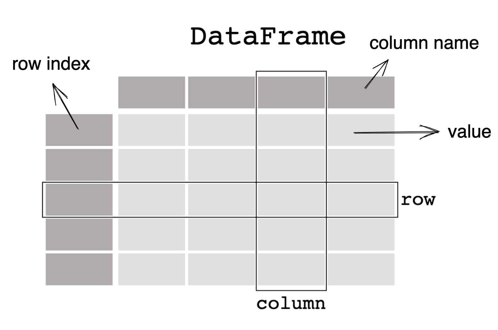

# Pandas_markdown

Pandas官方文档: https://pandas.pydata.org/docs/user_guide/

## Pandas的数据结构

### DataFrame[¶](https://pandas.liuzaoqi.com/doc/chapter0/入门pandas.html#dataframe)

通常情况下我们都是对 `pd.DataFrame` 进行操作，其基本结构如下图所示



```python
df = pd.DataFrame( {"Name": [
              "Braund, Mr. Owen Harris",
              "Allen, Mr. William Henry",
              "Bonnell, Miss. Elizabeth",],
              "Age": [22, 35, 58],
              "Sex": ["male", "male", "female"],})
df
```

### Series[¶](https://pandas.liuzaoqi.com/doc/chapter0/入门pandas.html#series)

此外，另一个需要关注的数据结构是 `pd.Series` ，`pandas`的每一列都是一个 Series


例如我们只对 age 列感兴趣，可以使用 `[]` 将其筛选出来，结果是便是一个`pd.Series`


## 基本操作

### 创建数据

使用pd.Series创建Series对象

```python
s = pd.Series([1,3,5,np.nan,6,8])
```

通过numpy的array数据来创建DataFrame对象

```python
dates = pd.date_range('20250601','20250606')
df = pd.DataFrame(np.random.randn(6,4), index = dates, columns = np.array(['A','B','C','D']) )

```

通过字典创建DataFrame对象

```python
df2 = pd.DataFrame({ 'A' : 1.,
                     'B' : pd.Timestamp('20130102'),
                     'C' : pd.Series(1,index=list(range(4)),dtype='float32'),
                     'D' : np.array([3] * 4,dtype='int32'),
                     'E' : pd.Categorical(["test","train","test","train"]),
                     'F' : 'foo' })
```

查看每一列数据类型

```python
df2.dtypes
```

### 数据查看

查看数据的顶部和尾部的方法

```python
df.head(n)
df.tail(n)
#n行数据
```

查看DataFrame对象的索引，列名，数据信息

```python
df.index
df.columns
df.values
```

描述性统计

```python
df.describe()
```

数据转置

```python
df.T
```

根据列名排序

```python
df.sort_index(axis=1, ascending=False) #按列降序, 默认升序(ascending=True)
```

根据B列数值排序

```python
df.sort_values(by='B')
```

### 数据选取

#### 使用[]选取数据

选取单列数据，等效于`df.A`:

```python
df['A']
```

按行选取数据，使用[]

```python
df[0:3]
df['20130102':'20130104']
```

#### 通过标签选取数据

```python
df.loc[dates[0]]
df.loc[:,['A','B']]
df.loc['20130102':'20130104',['A','B']]
df.loc['20130102',['A','B']]
df.loc[dates[0],'A']
df.at[dates[0],'A']
```

#### 通过位置选取数据

```python
df.iloc[3]
df.iloc[3:5, 0:2]
df.iloc[[1,2,4],[0,2]]
df.iloc[1:3]
df.iloc[:, 1:3]
df.iloc[1, 1]
df.iat[1, 1]
```

#### 使用布尔索引

```python
df[df.A>0]
df[df>0]
df2[df2['E'].isin(['two','four'])
```


### 缺失值处理

Pandas中使用`np.nan`来表示缺失值，可以使用`reindex`更改/添加/删除指定轴上的索引


#### 删除缺失值

舍弃含有NaN的行

```python
df1.dropna(how='any')
```


#### 填充缺失值

填充缺失数据

```python
df1.fillna(value=5)

pd.isnull(df1) #显示bool值
```


## 常用操作

### 统计

在进行统计操作时需要排除缺失值！

向求均值

```
#每一列的平均值
df.mean()
#每一行的平均值
df.mean(axis=1)
```

当两个 `Series` 或 `DataFrame` 的索引或列不完全一致时，Pandas 会自动将它们的索引/列合并为 **并集**（Union），作为运算结果的索引/列。未对齐会自动填补未NaN

### 用户定义的函数

定义的函数放在`DataFrame.agg()`和`DataFrame.transform()`处理对应的结果

|    **方法**     |                           **功能**                           |                       **输出形状**                        |             **典型场景**             |
| :-------------: | :----------------------------------------------------------: | :-------------------------------------------------------: | :----------------------------------: |
|    **`agg`**    | **聚合操作**：对数据进行汇总统计（如求和、均值、最大值等），返回降维后的结果。 | 可能为标量、`Series` 或 `DataFrame`（取决于输入和函数）。 | 计算统计指标（如每列的均值、总和）。 |
| **`transform`** | **转换操作**：对数据进行逐元素或逐列的转换，保持原数据形状。 |              与原 `DataFrame` 形状完全相同。              |   数据标准化、归一化、特征编码等。   |

```python
df.agg(lambda x: np.mean(x) * 2, axis = 1)

df.transform(lambda x:np.ceil(np.abs(x)) * 10)
```


### Value_Counts

```python
s = pd.Series(np.random.randint(0, 7, size=10))
s.value_counts()
```


### 字符串操作

series 的 str属性包含一系列处理字符串的方法, 

```python
s = pd.Series(["A", "B", "C", "Aaba", "Baca", np.nan, "CABA", "dog", "cat"])
s.str.lower()
```


## 数据合并

### Concat

```python
piece = [df[0:4],df[4:6],df[6:9]]
pd.concat(piece)
```

### Join

```python
left = pd.DataFrame({'key': ['foo', 'foo'], 'lval': [1, 2]})
right = pd.DataFrame({'key': ['foo', 'foo'], 'rval': [4, 5]})

pd.merge(left, right, on='key')
```

### Append

```python
s = df.iloc[3]
df.append(s, ignore_index=True)
```

## 数据分组

**数据分组**是指涉及以下一个或多个步骤的过程：

- 根据某些条件将数据分成几组
- 对每个组进行独立的操作
- 对结果进行合并

```python
df = pd.DataFrame({'A' : ['foo', 'bar', 'foo', 'bar',
                          'foo', 'bar', 'foo', 'foo'],
                   'B' : ['one', 'one', 'two', 'three',
                           'two', 'two', 'one', 'three'],
                   'C' : np.random.randn(8),
                   'D' : np.random.randn(8)})
df

df.groupby('A').sum()
df.groupby(['A', 'B']).sum()
```

## 数据重塑

### 数据堆叠

```python
stacked = df2.stack()
stacked.unstack()
```

### 数据透视表

```python
df.pivot_table(values='D', index=['A', 'B'], columns='C')
```

## 时间序列

```python
rng = pd.date_range('1/1/2012', periods=100, freq='S')
ts = pd.Series(np.random.randint(0, 500, len(rng)), index=rng)

#按分钟统计
ts.resample('5Min').sum()
#使用UTC
ts_utc = ts.tz_localize('UTC')
#时区转换
ts_utc.tz_convert('US/Eastern')
#跨度转换
ps = ts.to_period()
ps.to_timestamp()
#在周期和时间戳之间转换可以使用一些方便的算术函数。
```

## 数据分类

```python
df = pd.DataFrame({"id":[1,2,3,4,5,6], "raw_grade":['a', 'b', 'b', 'a', 'a', 'e']})
df['grade'] = df['raw_grade'].astype("category")
df['grade']
```

分类类型仅存储唯一值的列表（称为 `categories`），并通过整数索引引用这些值，而非存储原始字符串。

**重命名分类**

```python
new_categories = ["very good", "good", "very bad"]
df["grade"] = df["grade"].cat.rename_categories(new_categories)
df["grade"] = df["grade"].cat.set_categories(
    ["very bad", "bad", "medium", "good", "very good"]
)
df["grade"]
```

**排序**

```python
df.sort_values(by='grade')
```

**分组**

```python
df.groupby("grade").size()
```

## 数据可视化

```python
import matplotlib.pyplot as plt
plt.close("all")
```

## 导入和到出数据

### CSV

[Writing to a csv file:](https://pandas.pydata.org/docs/user_guide/io.html#io-store-in-csv) using [`DataFrame.to_csv()`](https://pandas.pydata.org/docs/reference/api/pandas.DataFrame.to_csv.html#pandas.DataFrame.to_csv)

```python
df = pd.DataFrame(np.random.randint(0, 5, (10, 5)))
df.to_csv("foo.csv")

pd.read_csv("foo.csv")
```

### Parquet

```python
df.to_parquet("foo.parquet")

pd.read_parquet("foo.parquet")
```


### Excel

```python
df.to_excel("foo.xlsx", sheet_name="Sheet1")

pd.read_excel("foo.xlsx", "Sheet1", index_col=None, na_values=["NA"])
```

