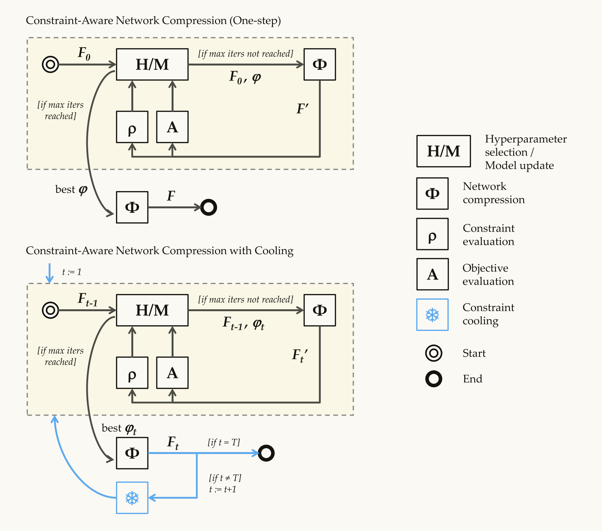
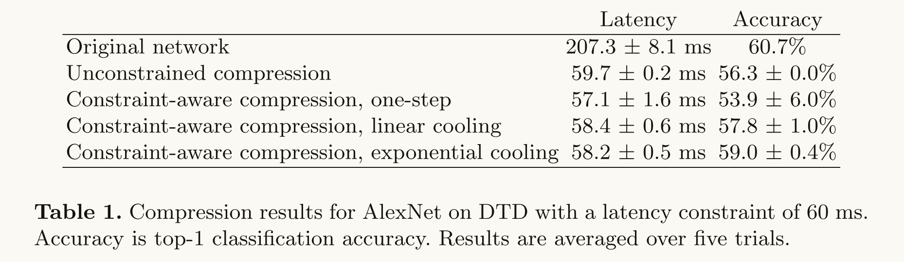
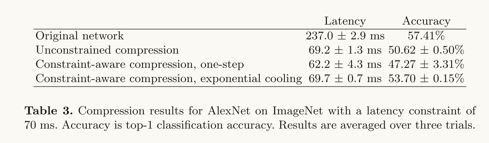

In this paper, we have presented a general frame-
work for training compressed networks that satisfy operational constraints in ex-
pectation.

Our framework is complementary to specific compression techniques
(e.g. distillation, pruning, quantization) and can accommodate any of these as
its compression module Φ. In future, we plan to study whether the constraint
cooling schedule can be learned, for example by using reinforcement learning.

where F0 is the original network to compress. For example, suppose we wish to compress a semantic segmentation network and ensure that the compressed network satisfies a maximum latency constraint of 100 ms at inference time.

剪枝， 减去不必要的参数压缩模型。 使用one-step方法进行压缩和使用cooling进行压缩， 理解什么是cooling