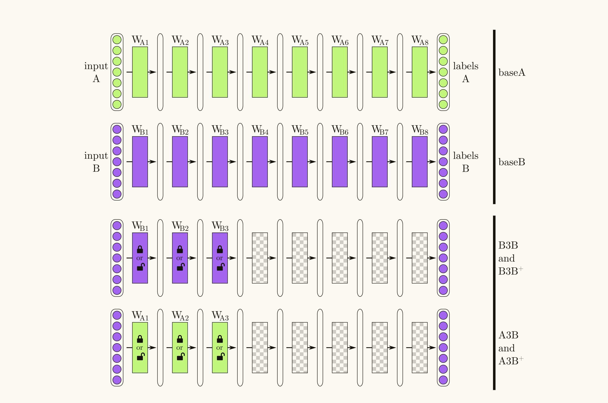
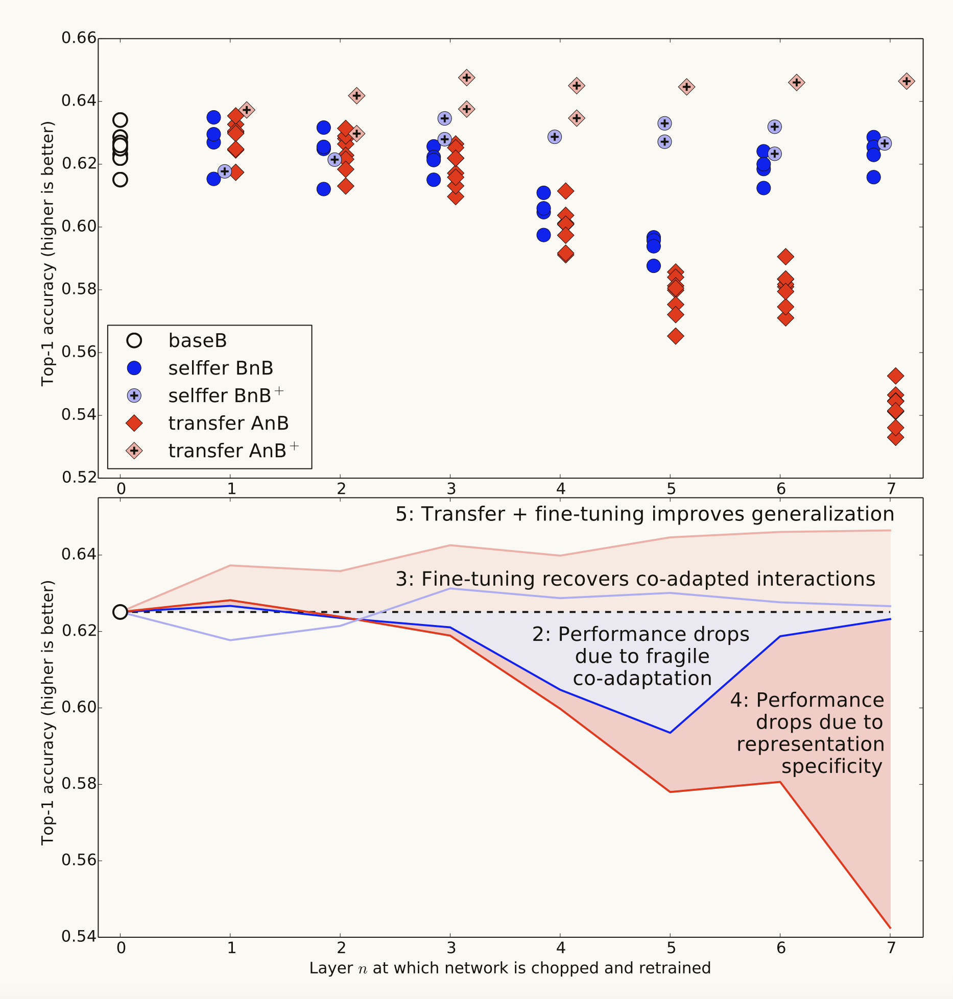

Many deep neural networks trained on natural images exhibit a curious phe-
nomenon in common: on the first layer they learn features similar to Gabor filters
and color blobs. Such first-layer features appear not to be specific to a particular
dataset or task, but general in that they are applicable to many datasets and tasks.

第一层的卷积核一般识别的feature map 不是针对任务特定的， 而是通用的特征。

重点是通用特征在网络的哪一步过程中转化为具体的特征。通用任务处理特定任务。

### Conclusion

We have demonstrated a method for quantifying the transferability of features from each layer of a neural network, which reveals their generality or specificity

有两个问题：

“splitting networks in the middle of fragilely co-adapted layers” 这里提到在脆弱共适应的层中间分割网络。可能是指在训练好的神经网络中，某些层之间已经形成了紧密的适应性，如果强行在这些层之间分割，可能会影响模型的性能。

**"splitting networks in the middle of fragilely co-adapted layers"**

指在训练过程中形成的 层间强耦合关系 处进行网络分割，导致优化目标难以协调。

* 脆弱共适应（Fragile Co-adaptation）：
  深度网络中相邻层可能通过反向传播形成复杂的特征依赖关系（如残差连接或注意力机制中的跨层交互）。若在此处分割，可能破坏特征传递的连贯性，导致训练不稳定或性能下降。
  在Transformer模型中，若在多头注意力层与FFN层之间分割，可能破坏自注意力机制与后续非线性变换的协同优化。
* 优化困难的表现：
  梯度冲突：分割后各子网络的梯度更新方向不一致，需额外协调机制（如联邦学习中的参数聚合）。
  通信开销增加：分割点处的中间激活值需频繁传输，增加带宽压力（尤其在无线边缘计算场景）。

**"specialization of higher layer features to the original task at the expense of performance on the target task"**

指高层网络特征过度适配原始任务，导致在目标任务（如迁移学习或边缘推理）中泛化能力不足。

- **特征专精的成因**：

  - **任务特定表征**：高层网络通常提取抽象语义特征（如ResNet的深层卷积核），若原始任务与目标任务差异较大（如自然语言处理→图像分类），这些特征可能无法迁移。
  - **过拟合风险**：在原始任务上过度训练的高层参数，可能对目标任务噪声敏感

- **性能损失的机制**：

  - **特征空间错位**：目标任务的输入分布与原始任务差异大，导致高层特征无法有效映射到新任务空间。

  - **决策边界偏移**：分割后高层网络的分类器直接复用，可能无法适应目标任务的类别分布（如医疗影像分类与通用物体识别）

    

### 方法

