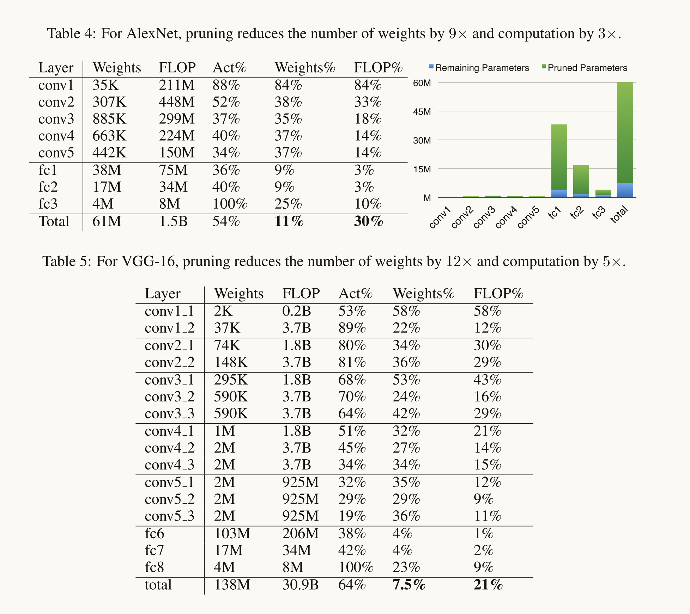

Our goal in pruning networks is to reduce the energy required to
run such large networks so they can run in real time on mobile devices. The model size reduction
from pruning also facilitates storage and transmission of mobile applications incorporating DNNs.

### 方法

在初始训练阶段之后，我们删除所有权重低于阈值的连接。此修剪将密集的全连接层转换为稀疏层。第一阶段学习网络的拓扑结构-学习哪些连接是重要的，并删除不重要的连接。然后，我们重新训练稀疏网络，以便剩余的连接可以补偿已删除的连接。

修剪和再训练的阶段可以迭代地重复以进一步降低网络复杂度。实际上，这个训练过程除了学习权重外，还学习网络连接-就像哺乳动物的大脑一样，在儿童发育的最初几个月创建突触，然后逐渐修剪很少使用的连接，下降到典型的成人值。

通过学习哪些连接是重要的，修剪不重要的连接，然后重新训练剩余的稀疏网络。

### 实验

在ImageNet上的AlexNet和VGGNet上的实验，表明完全连接层和卷积层都可以被修剪，连接数量减少了9倍到13倍，而不损失准确性。这使得实时图像处理的内存容量和带宽要求更小，更容易部署在移动的系统上。

